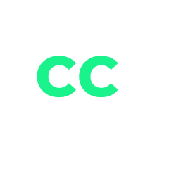

# The FrontEnders - CellCode

# Descrição do projeto
Projeto do Módulo 2 - Programação Orientada a Objetos do curso de Desenvolvimento Web Full-Stack da [Resilia](https://www.resilia.com.br/)

# Acesso ao projeto

Você pode acessar o deploy do projeto [aqui](https://fernandorussie.github.io/squadM2/)

# Abrir e rodar o projeto

- Crie um clone de `https://github.com/fernandorussie/squadM2.git`
- Abra uma IDE de sua preferência e use uma extensão (como Live Server) para rodá-lo

# Tecnologias utilizadas 👨🏻‍💻

- `HTML`
- `CSS`
- `JavaScript`
- `Bootstrap`

# Autores

### Daniel Oliveira

### Fernando Felip

### Kayllane Soares

### Vitor Borgatte

